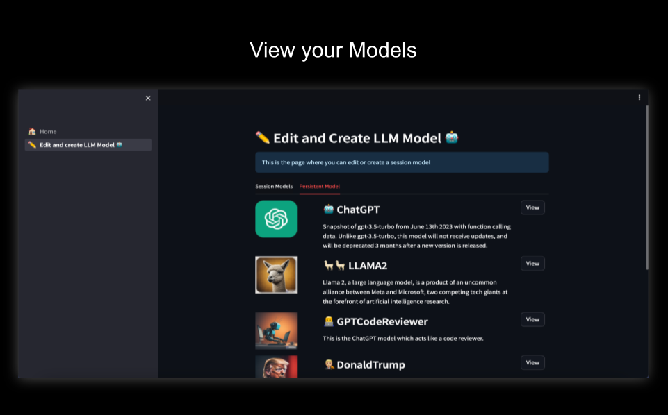

## Introducing AI Chatverse: A Playground for Chat Models

Dive into the world of conversational AI with AI Chatverse, a free and open-source application tailored for enthusiasts, developers, and AI aficionados alike. Built upon the robust foundation of Streamlit, AI Chatverse offers a user-friendly chat interface that seamlessly integrates with any chat model, be it from Langchain or a custom-built solution of your choice.

What sets AI Chatverse apart is its feature: the ability to dynamically craft a 'session model'. These session models allow users to modify and experiment with existing models in real-time. Whether you're keen on tweaking the system prompt, adjusting hyperparameters like temperature, or just wish to test the waters with chatbot models, AI Chatverse offers a playground for all your experimentation needs.





## Table of Contents
1. [Features](#features)
1. [The Architecture](#the-architecture)
1. [Quickstart](#quickstart)
    1. [Visit the hosted app](#quickstart)
    1. [Use the official docker image](#running-from-docker-locally-via-official-docker-image)
    1. [Build the docker image from source](#running-the-latest-version-of-the-app-from-source-in-docker)
1. [Documentation](#documentation)
1. [Maintainers](#maintainers)
1. [Attribution](#attribution)


## Features
* **Open Source and Free** The project has an opensource license.
* **Easy Integration with langchain** its very easy to integrate a model available in langchain.
* **Doesn't store data** We do not store any of your conversations, your messages are stored in streamlit sessions i.e once you close the App the data is gone!.
    
    *Note*: The model you use might store the data on it's end. Look into the specific model for more details.
* **Self-Hosted**: The application can be run in any environment which can run python application, we have dockerised the container so you can use that image as well.

## The architecture


## Quickstart
The best way to get started with the application is by visiting the application hosted in streamlit community cloud <a href="https://ai-chatverse.streamlit.app/" target="_blank"> here</a>.

**Note:** LLAMA2 uses llama cpp and needs a aritifact, it can only be run locally.

PS: Please configure the installation according to this <a href="https://python.langchain.com/docs/integrations/llms/llamacpp" target="_blank"> link </a>

### Running from docker locally via official docker image
The application can be run locally using docker by running the following command

```
docker run --rm -it -p 8501:8501 pevatrons/ai-chatverse
```

### Running the latest version of the app from source in docker
1. Clone the repository.
1. Build the image by running
    ```
    docker build -t ai_chaverse .
    ```
1. Run the application by
    ```
    docker run --rm -it -p 8501:8501 ai_chaverse:latest
    ```
1. Visit <a href="http://localhost:8501/" target="_blank">localhost:8501</a>

## Documentation
The documentation for the project is available in <a href="https://ai-chatverse.readthedocs.io/en/latest/index.html" target="_blank">readthedocs</a>.

## Maintainers
The application is created by <a href="https://www.pevatrons.net/" target="_blank">Pevatrons</a>.

We welcome collaboration and your contribution for this project.

## Attribution
Some of the logos in the view models have been generated using <a href="https://www.imagine.art/" target="_blank">Imagine Art</a> be mindfull of this if you are using it for commerical purposes.


